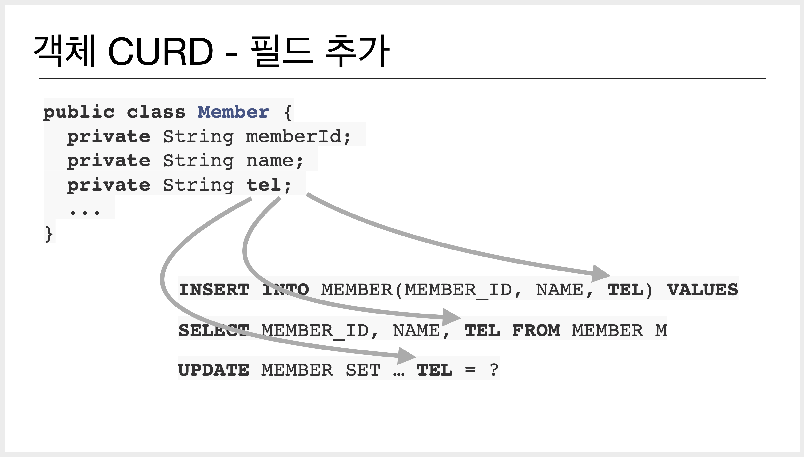
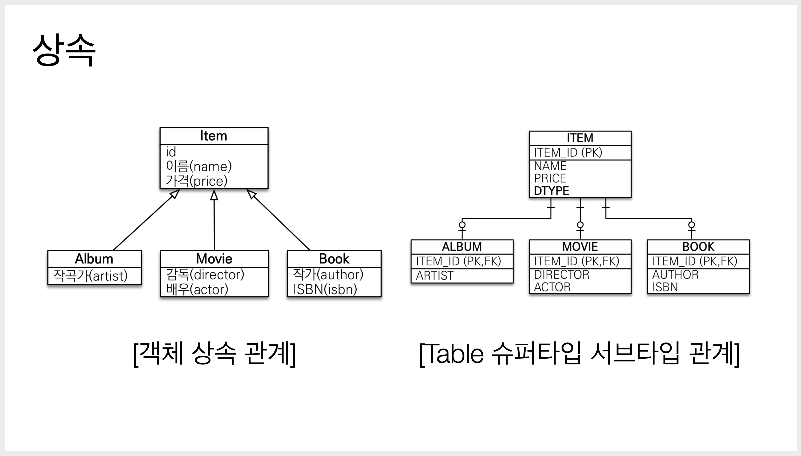
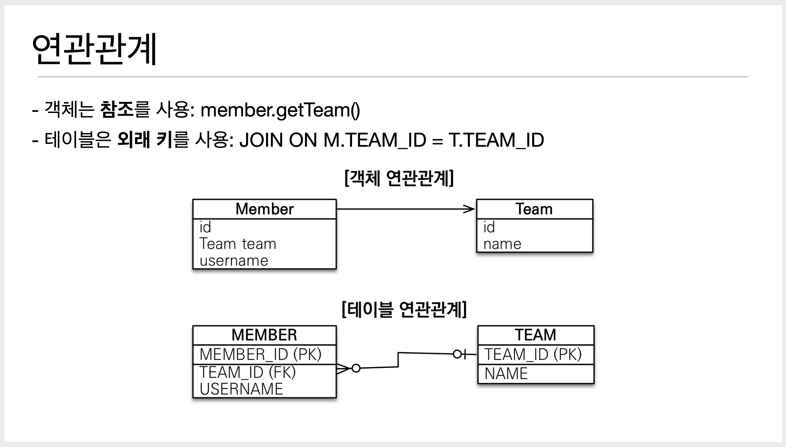
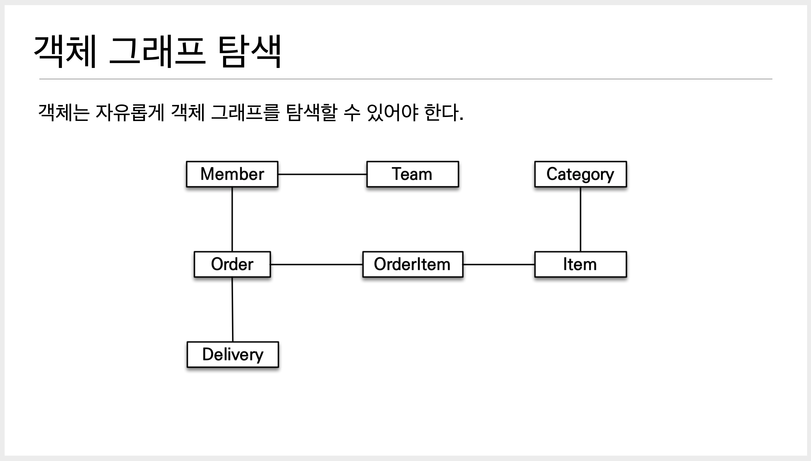
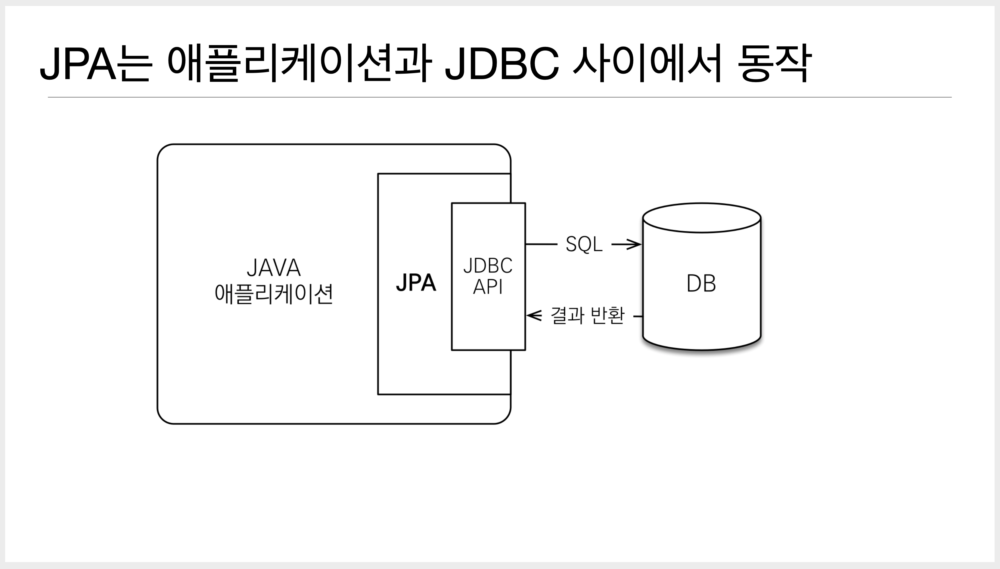
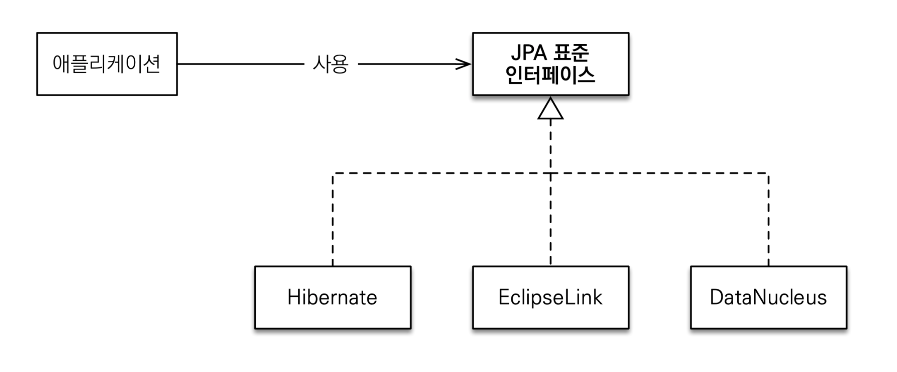
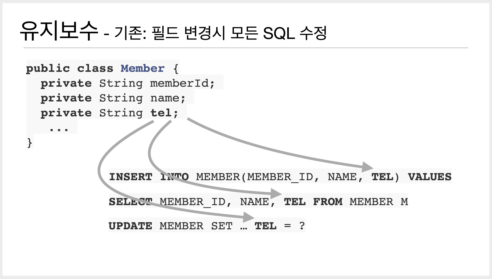
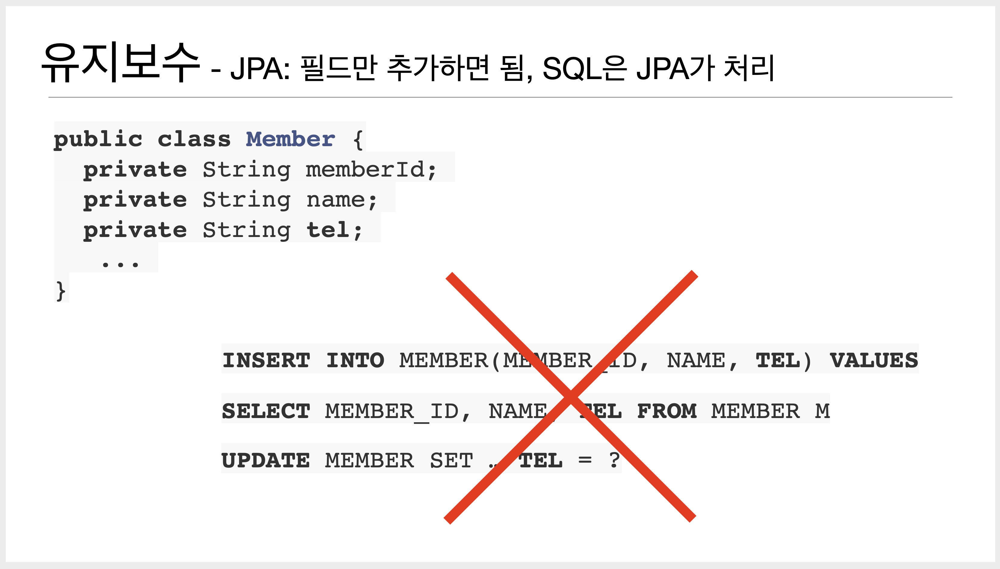

# 01. JPA 소개

## SQL 중심적인 개발의 문제점

### 반복, 반복, 그리고 반복

객체 CRUD ...

- INSERT INTO ...
- SELECT ...
- UPDATE ...
- DELETE ...

데이터베이스는 객체 구조와는 다른 데이터 중심의 구조를 가지므로 객체를 데이터베이스에 직접 저장하거나 조회할 수 없다. 개발자가 객체 지향 애플리케이션과 데이터베이스 중간에서 SQL과 JDBC API를 사용하여 변환 작업을 직접 해주어야 한다.

문제는 객체를 데이터베이스에 CRUD 하려면 **너무 많은 SQL과 JDBC API를 코드로 작성**해야 한다는 점이다.

### SQL에 의존적인 개발

#### 기존에 작성된 Member 객체에 연락처를 새로 추가해야 한다면?

- Member 테이블에 TEL 컬럼을 추가하고 Member 객체에 tel 필드를 추가한다.
- 이렇게만 수정하면 기존의 쿼리들에서 문제가 발생할 수 있다.
- 예를 들어 기존의 Member의 SELECT 쿼리를 그대로 사용하면 tel 필드는 null 값이 들어온다.
- Member 테이블에 연관된 모든 쿼리를 확인하고 수정해야 한다.



#### 여기서 각 Member가 Team을 가져야 한다는 요구사항이 추가된다면?

- Member 테이블에 TEAM_ID 컬럼을 추가하고 Member 객체에 Team 필드를 추가한다.
- 이때 Member를 가져와서 `member.getTeam()`을 호출하면 Team이 불릴 것이다... 라고 생각하지만, null이 반환된다.
- 이유는 기존의 `find()` 메서드가 Team 테이블을 조인해서 가져오지 않으므로 Team이 존재하지 않는 것이다.
- Member의 Team을 가져오기 위해서는 Team 테이블을 조인한 SQL로 이루어진 `findWithTeam()` 메서드를 새로 구현해야 한다.

이런 방식의 가장 큰 문제는 데이터 접근 계층을 사용해서 SQL을 숨겨도 어쩔 수 없이 DAO를 열어서 어떤 SQL이 실행되는지 확인해야 한다는 점이다.

SQL에 모든 것을 의존하는 상황에서는 개발자들이 **엔티티를 신뢰하고 사용할 수 없다.**

물리적으로는 SQL과 JDBC API를 데이터 접근 계층에 숨기는 데 성공했을지는 몰라도 **논리적으로는 엔티티와 아주 강한 의존관계**를 가지고 있다.

> Member를 조회할 때는 물론이고 Member 객체에 필드를 하나 추가할 때도 DAO의 CRUD 코드와 SQL 대부분을 변경해야 하는 문제가 발생한다.

요약하자면

- 진정한 의미의 **계층 분할**이 어렵다.
- 엔티티를 **신뢰**할 수 없다.
- **SQL에 의존적**인 개발을 피하기 어렵다.

### JPA와 문제 해결

JPA가 적절한 SQL을 생성해서 데이터베이스에 전달한다.

#### 저장 기능

```java
jpa.persist(member); // 저장
```

`persist()` 메서드는 객체를 데이터베이스에 **저장**한다.

메서드를 호출하면 JPA가 객체와 매핑정보를 보고 적절한 INSERT SQL을 생성해서 데이터베이스에 전달한다.

#### 조회 기능

```java
String memberId = "helloId";
Member member = jpa.find(Member.class, memberId); // 조회
```

`find()` 메서드는 객체 하나를 데이터베이스에서 **조회**한다.

객체와 매핑정보를 보고 적절한 SELECT SQL을 생성해서 데이터베이스에 전달하고 그 결과로 Member 객체를 생성해서 반환한다.

#### 수정 기능

```java
Member member = jpa.find(Member.class, memberId);
member.setName("new name"); // 수정
```

수정 메서드를 별도로 제공하지 않는다.

대신에 객체를 조회해서 값을 변경만 하면 트랜잭션을 커밋할 때 데이터베이스에 적절한 UPDATE SQL이 전달된다.

#### 연관된 객체 조회

```java
Member member = jpa.find(Member.class, memberId);
Team team = member.getTeam(); // 연관된 객체 조회
```

**연관된 객체를 사용하는 시점**에 적절한 SELECT SQL을 실행한다.

<br/>

## 패러다임의 불일치

객체는 **속성**(*field*)와 **기능**(*method*)을 가진다. 객체의 기능은 클래스에 정의되어 있으므로 객체 인스턴스의 상태인 속성만 저장했다가 필요할 때 불러와서 복구하면 된다.

그러나 부모 객체를 **상속**받았거나, 다른 객체를 **참조**하고 있다면 객체의 상태를 저장하기는 쉽지 않다.

관계형 데이터베이스는 데이터 중심으로 구조화되어 있고, 집합적인 사고를 요구한다. 그리고 객체지향에서 이야기하는 추상화, 상속, 다형성 같은 개념이 없다.

이것을 객체와 관계형 데이터베이스의 **패러다임 불일치 문제**라 한다.

문제는 이런 패러다임 불일치를 해결하는데 너무 많은 시간과 코드를 소비하는 데 있다.

### 상속

객체는 상속이라는 기능을 가지고 있지만, 테이블은 상속이라는 기능이 없다.

그나마 데이터베이스 모델링에서 이야기하는 **슈퍼타입 서브타입 관계**를 사용하면 객체 상속과 가장 유사한 형태로 테이블을 설계할 수 있다.



JDBC API를 사용해서 Album 객체를 저장하려면 부모 데이터만 꺼내서 Item용 INSERT SQL을 작성하고 자식 데이터만 꺼내서 Album용 INSERT SQL을 작성해야 한다.

상속의 경우 이렇게 추가로 작성해야 하는 코드가 많은데, 이런 과정이 패러다임 불일치를 해결하기 위한 비용이다.

#### JPA와 상속

JPA는 상속과 관련된 패러다임의 불일치 문제를 개발자 대신 해결해준다.

```java
jpa.persist(album);

/* 
 * JPA가 생성하는 SQL
 * 
 * INSERT INTO ITEM ...
 * INSERT INTO ALBUM ...
 */

String albumId = "id100";
Album album = jpa.find(Album.class, albumId);

/*
 * JPA가 생성하는 SQL
 *
 * SELECT I.*, A.*
 *     FROM ITEM I
 *     JOIN ALBUM A ON I.ITEM_ID = A.ITEM_ID
 */
```

### 연관관계

객체는 **참조**를 사용해서 다른 객체와 연관관계를 가지고 **참조에 접근해서 연관된 객체를 조회**한다.

반면에 테이블은 **외래 키**를 사용해서 다른 테이블과 연관관계를 가지고 **조인을 사용해서 연관된 테이블을 조회**한다.



또 다른 점은 객체는 참조가 있는 방향으로만 조회가 가능하지만 테이블은 외래 키 하나로 양방향 조회가 가능하다.

#### 객체를 테이블에 맞추어 모델링

```java
class Member {

    String id;       // Member_ID 컬럼 사용
    String teamId;   // TEAM_ID 컬럼 사용
    String username; // USERNAME 컬럼 사용
}
```

이렇게 객체를 모델링 할 경우 필드로 TEAM_ID(외래 키)를 가지고 있어서 `member.getTeam()` 을 통해 Team 객체를 참조할 수 없다.

이런 방식을 따르면 좋은 객체 모델링을 기대하기 어렵고 결국 객체지향의 특징을 잃어버리게 된다.

#### 객체지향 모델링

```java
class Member {

    String id;       // Member_ID 컬럼 사용
    Team team;       // 참조로 연관관계를 맺음
    String username; // USERNAME 컬럼 사용

    Team getTeam() {
        return team;
    }
}

class Team {

    Long id;         // TEAM_ID PK 사용
    String name;     // NAME 컬럼 사용
}
```

필드로 TEAM_ID(외래 키)를 가지는 것이 아니라 연관된 Team의 참조를 보관하므로 `member.getTeam()` 메서드를 통해 Team 객체를 참조할 수 있다.

그런데 이처럼 객체지향 모델링을 사용하면 객체를 테이블에 저장하거나 조회하기 쉽지 않다.

객체 모델은 외래 키가 필요 없고 단지 **참조**만 있으면 된다. 반면에 테이블은 참조가 필요 없고 **외래 키**만 있으면 된다.

결국, 개발자가 중간에서 **변환 역할**(*Mapper*)을 해야 한다.

#### JPA와 연관관계

```java
member.setTeam(team);   // 회원과 팀 연관관계 설정
jpa.persist(member);    // 회원과 연관관계 함께 저장

Member member = jpa.find(Member.class, memberId);
Team team = member.getTeam();
```

JPA는 회원과 팀의 관계를 설정하고 회원 객체를 저장하면 된다.

객체를 조회할 때 외래 키를 참조로 변환하는 일도 JPA가 처리해준다.

### 객체 그래프 탐색



객체에서 참조를 사용해서 연관된 객체를 찾는 것을 **객체 그래프 탐색**이라 한다.

```java
member.getOrder().getOrderItem()... // 자유로운 객체 그래프 탐색
```

객체는 마음껏 객체 그래프를 탐색할 수 있어야 한다. 그런데 이게 가능할까?

```sql
SELECT M.*, T.*
    FROM MEMBER M
    JOIN TEAM T ON M.TEAM_ID = T.TEAM_ID
```

MemberDAO에서 Member 객체를 조회할 때 위의 SQL을 실행해서 Member와 Team에 대한 데이터를 조회한다면 `member.getTeam()` 메서드는 성공하지만 다른 객체 그래프는 데이터가 없으므로 탐색할 수 없다.

```java
member.getOrder(); // null
```

**SQL을 직접 다루면 처음 실행하는 SQL에 따라 객체 그래프를 어디까지 탐색할 수 있는지 정해진다.**

비즈니스 로직에 따라 사용하는 객체 그래프가 다른데 언제 끊어질지 모를 객체 그래프를 함부로 탐색할 수는 없기 때문이다.

이는 개발자가 엔티티를 신뢰할 수 없는 문제로 이어진다.

```java
class MemberService {
    ...
    public void process() {
        Member member = memberDAO.find(memberId);
        member.getTeam(); // member -> team 객체 그래프 탐색이 가능할까
        member.getOrder().getDelivery(); // ???
    }
}
```

Member와 연관된 Team, Order, Delivery 방향으로 객체 그래프를 탐색할 수 있을지 없을지는 이 코드만 보고는 전혀 예측할 수 없다.

결국 데이터 접근 계층인 DAO를 열어서 SQL을 직접 확인해야 한다. 이것은 엔티티가 SQL에 논리적으로 종속되어서 발생하는 문제다.

그렇다고 member와 연관된 모든 객체 그래프를 데이터베이스에서 조회해서 애플리케이션 메모리에 올려두는 것은 현실성이 없다.

결국 MemberDAO에 회원을 조회하는 메서드를 **상황에 따라 여러 벌 만들어서 사용**해야 한다.

```java
memberDAO.getMember();                      // Member만 조회
memberDAO.getMemberWithTeam();              // Member와 Team 조회
memberDAO.getMemberWithOrderWithDelivery(); // Member와 Order와 Delivery 조회
```

#### JPA와 객체 그래프 탐색

JPA는 연관된 객체를 **조회하는 시점**에 적절한 SELECT SQL을 실행한다.

따라서 JPA를 사용하면 연관된 객체를 **신뢰**하고 마음껏 조회할 수 있다.

위의 방법은 실제 객체를 사용하는 시점까지 데이터베이스 조회를 미룬다고 해서 **지연 로딩**(*Lazy Loading*)이라 부른다.

또한 JPA에서는 연관된 객체를 즉시 함께 조회할지 아니면 실제 사용되는 시점에서 지연해서 조회할지 간단한 설정으로 정의할 수 있다.

### 비교하기

데이터베이스는 기본 키의 값으로 각 row를 구분한다. 반면에 객체는 동일성(identity) 비교와 동등성(equality) 비교라는 두 가지 방법이 있다.

- 동일성 비교 : `==` 비교다. 객체 인스턴스의 주소 값을 비교한다.
- 동등성 비교 : `equals()` 메서드를 사용해서 객체 내부의 값을 비교한다.

```java
String memberId = "100";
Member member1 = memberDAO.getMember(memberId);
Member member2 = memberDAO.getMember(memberId);

member1 == member2; // false
```

위의 예시는 같은 데이터베이스의 row를 조회했지만, 객체 측면에서 볼 때 둘은 다른 인스턴스이기 때문에 동일성 비교에는 실패한다.

#### JPA와 비교

JPA는 **같은 트랜잭션일 때 같은 객체가 조회되는 것을 보장**한다.

```java
String memberId = "100";
Member member1 = memberDAO.getMember(memberId);
Member member2 = memberDAO.getMember(memberId);

member1 == member2; // true
```

### 정리

객체 모델과 관계형 데이터베이스 모델은 지향하는 패러다임이 서로 다르다. 

문제는 이 패러다임 차이를 극복하려고 개발자가 너무 많은 시간과 코드를 소비한다는 점이고 객체지향 애플리케이션답게 정교한 객체 모델링을 할수록 패러다임의 불일치 문제는 더 커진다.

이 틈을 메우기 위해 개발자가 소모해야 하는 비용도 점점 더 많아진다.

JPA는 이러한 패러다임의 불일치 문제를 해결해주고 정교한 객체 모델링을 유지하게 도와준다.

<br/>

## JPA란 무엇인가?

**JPA**(*Java Persistence API*)는 자바 진영의 ORM 기술 표준이다.



#### 그렇다면 ORM은 무엇일까?

**ORM**(*Object-Relational Mapping*)은 이름 그대로 객체와 관계형 데이터베이스를 매핑한다는 뜻이다.

**객체**는 객체대로, **테이블**은 테이블대로 설계하면, ORM이 객체와 테이블을 매핑해서 패러다임 불일치 문제를 개발자 대신 해결해준다.

객체를 데이터베이스에 저장할 때, 객체를 마치 자바 컬렉션에 저장하듯이 ORM 프레임워크에 저장하면 ORM 프레임워크가 적절한 INSERT SQL을 생성해서 데이터베이스에 객체를 저장해준다.

ORM 프레임워크가 다양한 **패러다임 불일치 문제를 해결**해주므로 객체 측면에서는 정교한 객체 모델링을 할 수 있고 관계형 데이터베이스는 데이터베이스에 맞도록 모델링하면 된다.

자바 진영에서는 **하이버네이트 프레임워크**가 가장 많이 사용되고 대부분의 패러다임 불일치 문제를 해결해준다.

### JPA 소개

과거 자바 진영은 엔터프라이즈 자바 빈즈(EJB)라는 기술 표준을 만들었지만, 너무 복잡하고 자바 엔터프라이즈(J2EE) 애플리케이션 서버에서만 동작하는 단점이 있었다.

이때 하이버네이트(hibernate.org)라는 오픈소스 ORM 프레임워크가 등장했는데 가볍고 실용적인 데다가 기술 성숙도도 높았다.

결국 EJB 3.0에서 하이버네이트를 기반으로 새로운 자바 ORM 기술 표준이 만들어졌고 이것이 바로 JPA다.



JPA는 자바 ORM 기술에 대한 API 표준 명세다. 쉽게 이야기해서 인터페이스를 모아둔 것이다.

따라서 JPA를 사용하려면 JPA를 구현한 ORM 프레임워크를 선택해야 한다.

JPA 2.1을 구현한 ORM 프레임워크로는 하이버네이트, EclipseLink, DataNucleus가 있는데 이 중에 하이버네이트가 가장 대중적이다.

JPA라는 표준 덕분에 특정 구현 기술에 대한 의존도를 줄일 수 있고 다른 구현 기술로 손쉽게 이동할 수 있는 장점이 있다. 따라서 JPA라는 표준을 먼저 이해하고 필요에 따라 JPA 구현체가 제공하는 고유의 기능을 알아가면 된다.

### 왜 JPA를 사용해야 하는가?

#### 생산성

자바 컬렉션을 사용하듯이 JPA를 사용하면 된다.

```java
jpa.persist(member); // 저장
Member member = jpa.find(Member.class, memberId); // 조회
member.setName("update name"); // 수정
jpa.remove(member); // 삭제
```

따라서 지루하고 반복적인 코드와 CRUD SQL을 개발자가 직접 작성하지 않아도 된다.

#### 유지보수





JPA가 패러다임의 불일치 문제를 해결해주므로 객체지향 언어가 가진 장점들을 활용해서 유연하고 유지 보수하기 **좋은 도메인 모델을 편리하게 설계**할 수 있다.

#### 패러다임의 불일치 해결

앞서 살펴본 내용으로

- 상속 → 두 번의 INSERT SQL 이나 SELECT SQL시 JOIN을 JPA가 알아서 처리한다.
- 연관관계
- 객체 그래프 탐색 → 엔티티를 신뢰할 수 있고 자유로운 객체 그래프 탐색이 가능하다.
- 비교하기 → 동일한 트랜잭션에서 조회한 엔티티는 같음을 보장한다.

와 같은 패러다임 불일치 문제를 해결해준다.

#### 성능

JPA는 애플리케이션과 데이터베이스 사이에서 다양한 성능 최적화 기회를 제공한다.

**1차 캐시와 동일성(identity) 보장**한다.

- 같은 트랜잭션 안에서는 같은 엔티티를 반환한다 - 약간의 조회 성능이 향상된다(큰 성능향상은 X).
- DB Isolation Level이 Read Commit이어도 애플리케이션에서 Repeatable Read를 보장한다.

**트랜잭션을 지원**하는 쓰기 지연 - INSERT

- 트랜잭션을 커밋하기 전까지 INSERT SQL를 모은다.
- JDBC BATCH SQL 기능을 사용하여 한 번에 SQL을 전송한다(직접 사용하려면 코드가 상당히 지저분해진다).
- UPDATE SQL도 마찬가지이다.

**지연 로딩**을 지원한다.

- 지연 로딩 - 객체가 실제 사용될 때 로딩한다.
- 즉시 로딩 - JOIN SQL로 한 번에 연관된 객체까지 미리 조회한다(이전에 `getMemberWithTeam()` 메서드와 같은?!).
- JPA는 **옵션**을 통해 지연 로딩 또는 즉시 로딩을 선택적으로 사용할 수 있다.

#### 데이터 접근 추상화와 벤더 독립성

JPA는 애플리케이션과 데이터베이스 사이에 **추상화된 데이터 접근 계층을 제공**해서 애플리케이션이 **특정 데이터베이스 기술에 종속되지 않도록 한다.**

예를 들어 JPA를 사용하면 로컬 개발 환경은 H2 데이터베이스를 사용하고 개발이나 상용 환경은 오라클이나 MySQL 데이터베이스를 사용할 수 있다.

#### 표준

자바 진영의 ORM 기술 표준이여서 **다른 구현 기술로 손쉽게 변경**할 수 있다.