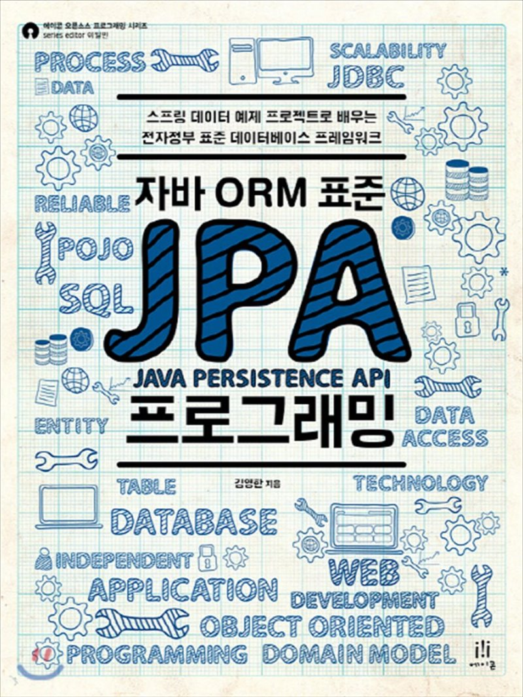

# 📒 자바 ORM 표준 JPA 프로그래밍

    

 

## Contents

[01. JPA 소개](./01-JPA-소개.md)

 

## 참고 자료

[자바 ORM 표준 JPA 프로그래밍 - 김영한](http://www.yes24.com/Product/Goods/19040233)

[자바 ORM 표준 JPA 프로그래밍 기본편 - 인프런](https://www.inflearn.com/course/ORM-JPA-Basic)

